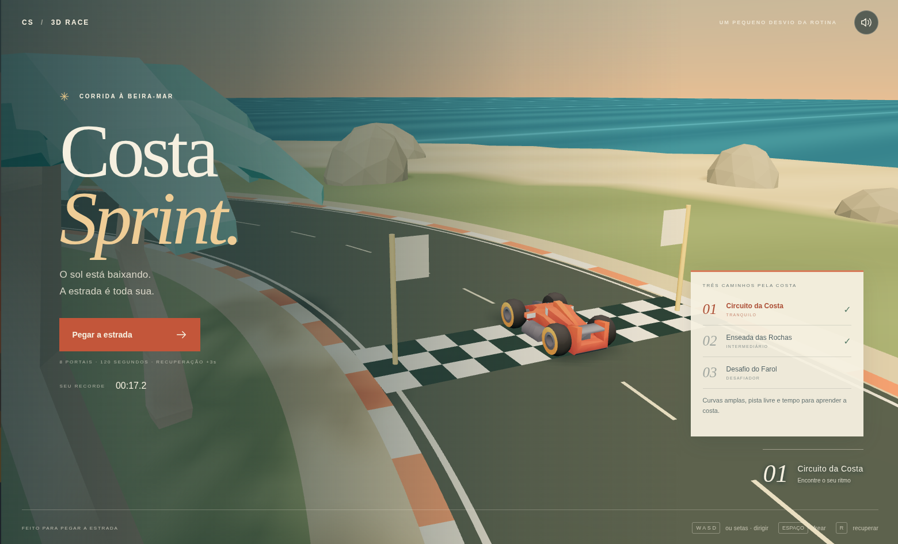

# Costa Sprint · 3D Race

Projeto pessoal criado exclusivamente para **testar e aprender Three.js na prática**, explorando o desenvolvimento de um pequeno jogo 3D no navegador.

A ideia foi experimentar cenas tridimensionais, carregamento de modelos, iluminação, materiais, câmeras, controles e regras de jogo. O resultado é uma corrida costeira com três pistas, dificuldade crescente, obstáculos, checkpoints e recordes locais, feita com **Three.js, TypeScript e Vite**.



## Executar

Requer Node.js 22. Em uma instalação nova:

```sh
npm ci
npm run dev
```

Abra a URL informada pelo Vite. Para distribuição estática: `npm run build`; para conferir o build: `npm run preview`. Não precisa de servidor de dados, conta ou serviço externo. Todos os modelos e texturas são locais.

## Jogar

Escolha um dos **três níveis** e clique em **Pegar a estrada**. Após a contagem de três segundos, complete uma volta passando pelos **oito portais em ordem**. Cruzar um portal ao contrário ou saltar portais não valida a passagem. O melhor tempo e a conclusão de cada nível são salvos neste navegador; apagar os dados do site apaga o progresso. O recorde da primeira versão é preservado no Circuito da Costa.

| Nível                   | Desafio                                                                 | Limite |
| ----------------------- | ----------------------------------------------------------------------- | ------ |
| 01 · Circuito da Costa  | Curvas amplas, pista de 12 m, sem obstáculos                            | 120 s  |
| 02 · Enseada das Rochas | Novo traçado, pista de 10 m e cinco rochas para desviar                 | 85 s   |
| 03 · Desafio do Farol   | Curvas fechadas, sete rochas, pista de 8,8 m, passagem de 6,6 m e areia | 65 s   |

Todos os níveis estão disponíveis para praticar. Ao vencer, use **Próximo nível** para continuar a viagem. Os percursos concluídos recebem uma marca na seleção. Impactos com rochas reduzem a velocidade e acrescentam **1,5 segundo** por colisão, com um intervalo para evitar penalidades por frame. Nos trechos claros de areia do Farol, a velocidade e a resposta da direção diminuem: reduza antes da curva.

- **W / seta para cima:** acelerar.
- **A e D / setas laterais:** virar.
- **S / seta para baixo / espaço:** frear; segurando parado, engata a ré.
- **R / Recuperar:** voltar ao último portal validado, com **3 segundos de penalidade** e breve intervalo entre recuperações.
- **Esc / P:** pausar ou continuar. O relógio e o carro ficam congelados.
- **Som:** botão no canto superior; áudio sintetizado, iniciado após interação.
- **Celular:** botões de direção, aceleração e freio com suporte a vários dedos. Jogar na horizontal oferece mais visão.

As bordas limitam a pista e reduzem a velocidade em impactos. A recuperação também resolve qualquer situação em que o carro fique mal orientado. Não há tombamento permanente. Ao sair da aba, o jogo pausa. Reiniciar limpa contagem, posição, velocidade, portais e penalidades.

## Estrutura

- `src/levels.ts`: identidade, limites, geometria e obstáculos dos três percursos.
- `src/game.ts`: domínio independente, geometria do circuito, movimento, estados, colisões e portais. Passos internos limitados a 1/60 s.
- `src/scene.ts`: Three.js, câmera, materiais, iluminação, cenário e carregamento GLTF. Palmeiras e marcas da pista usam instâncias para reduzir chamadas de desenho.
- `src/ui.ts` e `src/style.css`: telas inicial/pausa/resultado, HUD, mapa real do circuito, controles de toque. Atualização do HUD em cerca de 12 Hz.
- `src/audio.ts`: motor e sinais sintetizados com Web Audio, sem arquivos externos.
- `src/main.ts`: entrada, ciclo do jogo, teclado, persistência e integração.

Three.js + TypeScript + Vite. O escopo fechado deste jogo usa um modelo de condução arcade determinístico, sem a complexidade de simular suspensão/tombamento com corpos rígidos. A renderização não utiliza estado React por frame.

## Verificação

```sh
npm test
npm run build
```

Quinze testes verificam: circuito fechado, partida explícita, contagem/pausa, portais em ordem e sentido correto, chegada, colisões, recuperação, penalidades, derrota por tempo, reinício e ré. As simulações conduzem continuamente os três percursos, sem saltar portais; os dois níveis avançados podem ser vencidos sem colisões. Os testes adicionais verificam limites por nível, obstáculos sólidos, penalidade por impacto, areia, passagem estreita e reinício preservando o nível.

A revisão no navegador cobre carregamento local, condução via teclado, recuperação, pausa/retomada, reinício, chegada e persistência do recorde, além de telas e toque no viewport móvel. As imagens de revisão acompanham a entrega. Desempenho varia conforme GPU; pixel ratio limitado, sombras de 1024 px e modelos leves. WebGL indisponível ou erro de carregamento apresenta mensagem de recuperação; não existe fallback de jogo 2D.

## Assets e licenças

Modelos gratuitos **CC0**, obtidos de fontes oficiais:

- [Kenney Car Kit](https://kenney.nl/assets/car-kit): `public/assets/cars/race.glb` e `Textures/colormap.png`.
- [Kenney Nature Kit](https://kenney.nl/assets/nature-kit): `public/assets/nature/tree_palmDetailedTall.glb` e `rock_largeA.glb` (obstáculos).

Licenças originais e créditos: `public/assets/LICENSES/`. Não há recursos pagos nem dependência de CDN. Geometria do circuito, terreno, mar e interface foram criados para esta experiência. Fontes de sistema (Arial/Georgia), sem download de fontes.
